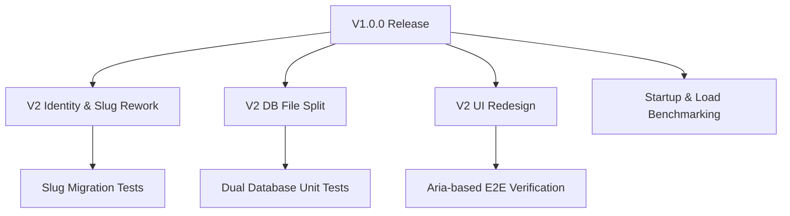

# GoBuddy: Testing Strategy & Suite Evaluation

This report evaluates the current testing strategy, coverage, quality, and maintainability of the **GoBuddy** project in preparation for a stable **Version 1 (V1)** release.

---

## 1. Executive Summary

GoBuddy is a local-first, native-wrapped companion app for Pokémon GO. Because the application runs offline and stores all personal collection data on the device, its core engineering priorities are **data safety, schema stability, and portable user migrations**.

The current test suite is divided into:

1. **Unit Tests (23 cases, ~1.2s execution):** Run in Node.js via `tsx --test` using native `node:test` and `node:assert/strict` libraries.
2. **E2E Tests (3 cases, ~44s execution):** Run in a Chromium browser via Playwright.

### Overall Assessment

The testing infrastructure is **outstandingly lightweight, fast, and maintainable**. By using Node's native test runner, the project avoids the package bloat and configuration drift associated with third-party runners like Jest or Vitest.

However, there is a mismatch between the parts of the codebase designed for testability and the actual test coverage. Key business logic engines—such as search parsing, fuzzy matching, and raw SQL statistics queries—currently have **zero test coverage**. Addressing these gaps will significantly reduce the risk of regression during V1 prep and future V2 refactoring.

---

## 2. Current Testing Assessment

### Framework and Architecture

- **Zero-Dependency Unit Testing:** Using `node:test` and `node:assert` keeps developer environment setup trivial and CI run times extremely fast.
- **SQL Mocking Adapter:** [node-sqlite-connection.ts](file:///home/nick/Repos/GoBuddy/test/node-sqlite-connection.ts) is a custom adapter mapping Capacitor SQLite query signatures onto Node's built-in synchronous `node:sqlite` (`DatabaseSync`). This allows running migration and sync code in-memory inside unit tests without spinning up a browser.
- **E2E Separation:** Playwright tests run Chromium in a single-worker mode to avoid CPU contention during cold-boot database syncs, providing a robust smoke-test suite.

### What is Currently Tested

| Feature/Module | Test File | Test Type | Coverage Details |
| :--- | :--- | :---: | :--- |
| **Cascades Engine** | [cascades.test.ts](file:///home/nick/Repos/GoBuddy/test/cascades.test.ts) | Unit | Verifies that checking combined tiers (e.g. Shundo) propagates to constituent fields (Shiny, 4★, Caught) across different sections (Standard, Dynamax, Lucky). |
| **Schema Migrations** | [migrations.test.ts](file:///home/nick/Repos/GoBuddy/test/migrations.test.ts) | Unit | Verifies fresh database setup, incremental version replays, schema no-ops, and version downgrade guards. |
| **Reference Sync** | [reference-sync.test.ts](file:///home/nick/Repos/GoBuddy/test/reference-sync.test.ts) | Unit | Verifies reference data initialization, content-hash no-op detection, and quarantining of orphaned personal rows. |
| **Import / Export** | [export-import-round-trip.test.ts](file:///home/nick/Repos/GoBuddy/test/export-import-round-trip.test.ts) | Unit | Verifies round-trip serializability, skipping obsolete slugs, replacing local state (wipe-on-restore), and preserving version hashes. |
| **UI Caught Filter** | [bulk-form-edit-caught-filter.test.ts](file:///home/nick/Repos/GoBuddy/test/bulk-form-edit-caught-filter.test.ts) | Unit | Verifies stateless logic matching caught/uncaught form states for bulk edit grids. |
| **App Boot Smoke** | [boot.spec.ts](file:///home/nick/Repos/GoBuddy/e2e/boot.spec.ts) | E2E | Smoke test confirming the main dex grid renders and the boot rescue screen does not. |
| **UI Persistence** | [persistence-and-stats.spec.ts](file:///home/nick/Repos/GoBuddy/e2e/persistence-and-stats.spec.ts) | E2E | Verifies that checking a checkbox saves to IndexedDB, updates the Stats route counters, and survives a reload. |
| **Settings & Backup** | [settings-and-export.spec.ts](file:///home/nick/Repos/GoBuddy/e2e/settings-and-export.spec.ts) | E2E | Verifies settings theme switches, backup checkboxes, export triggers, file download, and import restore logic. |

---

## 3. Coverage Gaps

The following critical business logic structures have **no automated test coverage**:

### A. Search Normalization & Query Parsing

- **Affected Code:** `parseSearchQuery()` and `fuzzyMatches()` inside [repository.ts](file:///home/nick/Repos/GoBuddy/src/data/repository.ts).
- **The Gap:** The search bar handles complex logic, including punctuation stripping (e.g., matching Farfetch’d via curly quote normalization), keyword parsing (e.g., `!legendary`), and fuzzy subsequence matching (e.g., matching "Pikachu" from "pikchu"). None of this logic is unit-tested. A regression here would make finding species impossible for users.

### B. Boot Failure Rescue Export

- **Affected Code:** [boot-rescue-read.ts](file:///home/nick/Repos/GoBuddy/src/data/boot-rescue-read.ts).
- **The Gap:** The codebase was deliberately split to separate `boot-rescue-read.ts` from `boot-rescue.ts` so it could run in plain Node unit tests without bringing in Capacitor/jeep-sqlite imports. However, **no unit tests were ever written for it**.
- **Risk:** This module is the application's ultimate safety net. If a migration crashes, the app fails to boot, and this module must scrape the corrupt database to rescue the user's data. If it has bugs, the user experiences total data loss.

### C. Completion Stats SQL Lenses

- **Affected Code:** [completion-stats-sql.ts](file:///home/nick/Repos/GoBuddy/src/data/completion-stats-sql.ts).
- **The Gap:** The completion KPI calculations are performed using raw SQL queries with complex subqueries and joins (e.g., filtering out costumes, excluding regional exclusives if configured, verifying all mega variants). None of these SQL structures are tested.
- **Risk:** Modifications to the database schema or form lists could easily break these queries, leading to incorrect completion metrics and broken missing-species lists.

### D. SQLite Write Queue & Transactions

- **Affected Code:** [sqlite-repository.ts](file:///home/nick/Repos/GoBuddy/src/data/sqlite-repository.ts).
- **The Gap:** The write queue, bulk transactions (`runBulk`), default settings bootstrapping, and write error callbacks are not covered by unit tests because the module is directly coupled to Capacitor plugin imports.
- **Risk:** SQLite concurrency issues, malformed transactions, or unhandled write failures would go undetected.

---

## 4. Prioritized Recommendations

Recommendations are prioritized by their impact on data integrity, regression prevention, and V1 release stability.

### High Priority (Critical for V1 Stability)

#### 1. Implement Unit Tests for `boot-rescue-read.ts`

- **Goal:** Verify that the rescue exporter can read partially corrupted schemas (e.g., missing tables, renamed columns) and salvage remaining user data.
- **Why:** High data-safety risk. This is the last-resort recovery tool for user databases.
- **Implementation Plan:** Use `nodeSqliteConnection` in a new unit test file to populate incomplete databases and verify `readPersonalDataBestEffort` outputs correct JSON.

#### 2. Implement Unit Tests for Search & Normalization

- **Goal:** Write unit tests covering `parseSearchQuery` (negation, keywords like `ultrabeast`), `fuzzyMatches` (subsequences), and `normalizeForSearch` (punctuation removal, curly quote replacements).
- **Why:** High user-experience impact. Broken search impairs the primary navigation mechanism.
- **Implementation Plan:** These are pure, stateless functions that can be tested in isolation inside a new `test/search.test.ts` file.

---

### Medium Priority (Recommended before V1 release)

#### 3. Test Completion Stats SQL via the Node SQLite Connection

- **Goal:** Run raw SQL lens queries in `completion-stats-sql.ts` against the in-memory `node:sqlite` connection.
- **Why:** Protects completion tracking logic (the primary analytical feature) from regressions.
- **Implementation Plan:** Add tests to execute `getCompletionStatsSql` over pre-populated fixtures representing regional exclusives, mega variants, and Gigantamax forms.

#### 4. Decouple and Test `sqlite-repository.ts` Concurrency

- **Goal:** Refactor `createSqliteRepository` to accept the database connection and the persistence callback as injected dependencies.
- **Why:** Enables unit testing the write-through serialization queue and transactional bulk operations (`bulkSetFormPersonalField`).

---

### Low Priority (Can be deferred to post-V1)

#### 5. Expand E2E Tests to Cover Bulk Editing and Search

- **Goal:** Add Playwright tests that perform bulk checks, apply keyword filters, and assert changes persist.
- **Why:** Smoke-tests the UI-to-Repository wiring.
- **UI Redesign Note:** Since the UI is scheduled for a rewrite in V2, these E2E tests should be minimal and leverage robust `aria-role` locators rather than brittle class-based CSS selectors to maximize longevity.

---

## 5. Suggested Roadmap (Post-V1)

The following roadmap is aligned with the V2 planned refactorings:

### 1. Migrations for the Identity/Slug Rework (V2)

- **Context:** Slugs will shift from display-derived text to stable Niantic IDs.
- **Testing Goal:** The test suite must include robust migration coverage verifying that existing personal database rows, as well as quarantined slugs in `personal_data_quarantine`, successfully map to new ID formats without orphaned records.

### 2. Dual Database Unit Testing (V2)

- **Context:** The database will be physically split into reference and personal `.sqlite` files.
- **Testing Goal:** Unit tests must be extended to run against multiple database connections, verifying data safety and schema migration isolation on both files.

### 3. Startup Benchmarking tests

- **Context:** Optimization work to replace sequential first-boot inserts with pre-baked SQLite file assets.
- **Testing Goal:** Write automated scripts to run boot-time load checks under simulated network/disk limits, tracking database load latency.

---

## 6. Version 1 Release Blockers

There are **no critical automated test failures or code bugs** blocking a V1 tag.

However, we recommend the following manual/operational verification before tag release:

> [!WARNING]
> **Pre-Release Manual Boot Rescue Verification:**
> Since the Boot Failure Rescue screen rendering path cannot be easily verified in automated tests, the owner should perform a manual verification run:
>
> 1. Force a database crash (e.g. inject syntax errors in migrations or manually corrupt the SQLite schema during startup).
> 2. Confirm the Boot Rescue screen renders.
> 3. Verify that the "Export anyway" button triggers, successfully extracts user data, and downloads a portable `.json` file that Settings → Import can read back.
